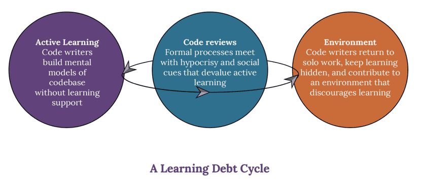

% Learning Cultures in Tech
% Dan Mazur, PhD
% www.danmazur.ca/slides/learning_cultures.html

## Outline

* The Learning Debt Cycle (~15 min)
* Structured Discussion (~60 min)
* Takeaways and Action Items (~15 min)

## It's Like Coding In The Dark

[The Need For Learning Cultures Within Coding Teams](https://www.catharsisinsight.com/_files/ugd/fce7f8_2a41aa82670f4f08a3e403d196bcc341.pdf)

Catherine Hicks, Catharsis Consulting, 2022

## Active Learning Is Invisible

* Learning by testing conceptual mental models with tangible examples
* Goal is to scaffold understanding until confident you can contribute

## Invisible Work

* Refactoring / technical debt
* Glue work (see: [Tanya Reilly - https://noidea.dog/glue](https://noidea.dog/glue))
*

## Code Reviews Don't Feel Safe

* Reputation threat
* Focus on "sounding like an engineer"
* Feels like being tested

## Lonely Environment

* Back to coding alone
* Minimal Support
* Hide your learning work

## Coding in the dark

“It’s like coding in the dark. Every once in a
while someone comes in to turn on the
lights and stare at you, like review, but then
you feel like you have to defend something.
But mostly I feel like I’m just sitting here
with all the lights off.”

## Learning Debt Cycle

## Learning Debt

When learning is **necessary but discouraged**, so learning becomes hidden

## Recommendations

* Involve people in defining "success"
* Encourage developmental feedback
* Make documentation and collaboration "count"
* Celebrate collaborative support
* Make the costs of learning debt visible

## "Being Glue" Recommendations

[Tanya Reilly - https://noidea.dog/glue](https://noidea.dog/glue)
* Learn deliberately
* Learn at work
* Be public about what you are learning
* Watch out for learning opportunities. Don't automatically do things for people.
* Ensure no invisible/glue work on job ladder

## Discussion Questions

## Stories that demonstrate that active learning is real work

Was the work celebrated?

## When have you felt safe/unsafe during a code review?

## When have you felt lonely or unsupported while working?

## What was your best or worst experience onboarding at a new team/company?

## What was your best or worst experience collaborating on a problem?

## How are decisions, documentation, and knowledge shared in your organizations?

What works best?

## When have you received helpful feedback outside of formal performance reviews?

## Have you made a mistake at work? What happened?

## Has it ever been really hard/easy to ask for help?

## When have you met with hypocrisy around learning?

It's okay to make mistakes, but it's not okay to make that mistake.

## When has someone tried to improve the learning culture, but faced pushback?

## When has your learning work been the most visible or invisible?

## Takeaways and Action Items
